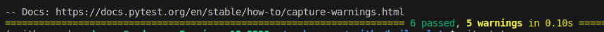

# Fastapi boilerplate

Esse repositório define uma estrutura básica de um projeto ```Fastapi```.   
Nele está definido o  ```Postgres``` como banco de dados,  
usa o ```Poetry``` como gerenciador de pacotes,
usa o ```SqlAlchemy``` como ORM e ```Alembic``` para as migrações.    
Nele também vem um sistema CRUD, 
com rotas, integração com banco e ```testes```.
O projeto usa ```Docker``` e ```Docker Compose``` para execução do mesmo.

## Outros pacotes importantes utilizados

* uvicorn
* alembic
* pytest
* blue
* ruff
* isort
* pydantic-settings
* pydantic
* loguru

# Rodando a aplicação

Para rodar a aplicação você precisar ter o ```Docker``` e o ```Docker Compose``` instalados.
Com isso ok, basta executar

```
$ docker compose up --build
```

ou dependendo da sua versão instalada

```
$ docker-compose up --build
```

Pronto, agora basta acessar a ```http://localhost:8000/docs``` para visualizar a documentação interativa e poder
fazer uso da API de CRUD desenvolvida.

# Rodar os testes

O projeto possui testes relacionados ao CRUD que podem ser executados da seguinte forma:

Subir o container igual mostrado na item anterior só adicionando a opção ```-d```
e depois executar:

```
$ docker exec -it  boilerplate  bash -c "make test"
```
resultado:



## Local

É possível rodar os testes localmente, sem usar o Docker.   
Você pode criar o seu ```ambiente virtual``` python, instalar o ```Poetry``` 
e executar:

```
$ poetry install --no-interaction --no-ansi
```

e então rodar os testes

```
$ make test
```


